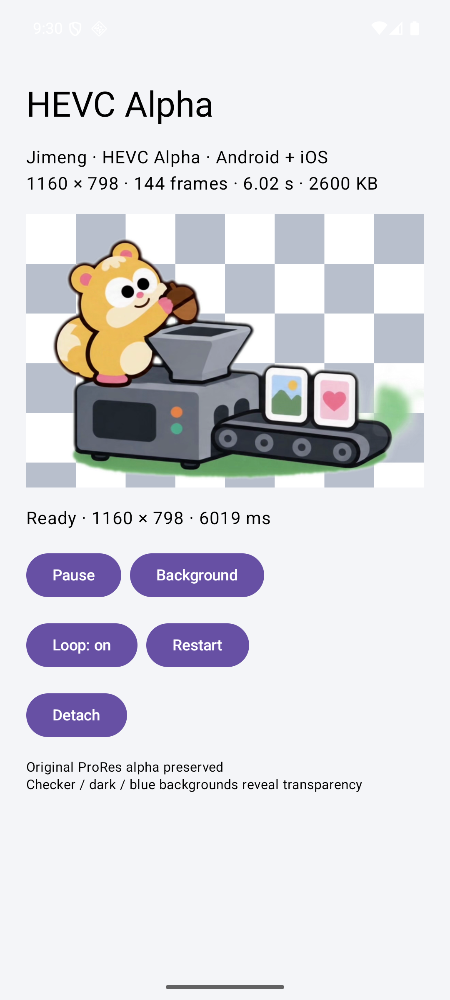
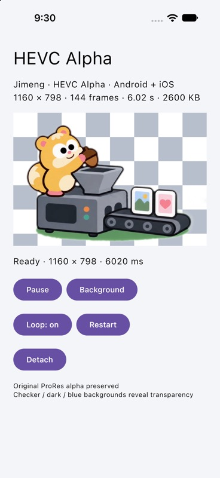

# AlphaVideo

在 **Compose Multiplatform 的 Android 和 iOS 应用中播放带透明通道的 HEVC 视频**。两个平台共用 `AlphaVideo` Composable 和同一个 `.mov` 文件，透明像素直接与下方的 Compose 内容合成。

输入采用 Apple HEVC with Alpha 的辅助透明层格式，无需把视频拆成 RGB 和 mask 两个文件。底层解码分别适配平台，布局、调用方式和播放控制保持一致。

| Android | iOS |
| --- | --- |
|  |  |

## 功能与支持范围

- 播放、暂停、循环播放，接收加载、就绪、结束和失败状态。
- 支持 `ContentScale.Fit` / `Crop`，遵循 Compose 的布局、裁剪和层级关系。
- 应用进入后台自动暂停，回到前台按 `playing` 状态继续；移除组件时释放播放器。
- 更换 `source` 会重建播放器。非循环播放结束后，可用新的 `key` 重新播放。

| 项目 | Android | iOS |
| --- | --- | --- |
| 系统最低版本 | API 29 / Android 10 | iOS 18 |
| 架构 | `arm64-v8a`、`x86_64` | 设备 arm64、模拟器 arm64 |
| 解码实现 | FFmpeg 8.1.1 软件解码 + C/JNI | AVFoundation + Kotlin/Native |
| 绘制实现 | RGBA Bitmap → Compose Image | BGRA → Skia Bitmap → Compose Image |
| 已验证运行环境 | Android 16 / API 36 模拟器 | iOS 27 arm64 模拟器 |

当前支持 **8-bit Apple HEVC Alpha 互操作格式**：透明度范围 0–255，视频轨道无需旋转。输入必须是本地文件的绝对路径；Compose resources 中的视频需先复制到缓存目录。普通无透明层 HEVC 文件不属于该组件的支持范围。

目前不提供音频、网络下载、seek 或桌面端支持。Android 解码器过载时会延迟呈现帧；高分辨率、多个同时播放的组件以及真机性能需要针对实际设备测量。

## 快速接入

目前以源码模块方式接入，尚未发布 Maven 制品。

在本仓库的 KMP 模块中添加依赖：

```kotlin
// build.gradle.kts
kotlin {
    sourceSets {
        commonMain.dependencies {
            implementation(project(":alphavideo"))
        }
    }
}
```

在 `commonMain` 中调用：

```kotlin
import androidx.compose.foundation.background
import androidx.compose.foundation.layout.Box
import androidx.compose.foundation.layout.fillMaxSize
import androidx.compose.runtime.Composable
import androidx.compose.ui.Modifier
import androidx.compose.ui.graphics.Color
import androidx.compose.ui.layout.ContentScale
import dev.alphavideo.AlphaVideo
import dev.alphavideo.AlphaVideoSource
import dev.alphavideo.AlphaVideoStatus

@Composable
fun TransparentAnimation(
    localFilePath: String,
    playing: Boolean = true,
    onStatus: (AlphaVideoStatus) -> Unit = {},
) {
    Box(Modifier.fillMaxSize().background(Color(0xFF202735))) {
        AlphaVideo(
            source = AlphaVideoSource(localFilePath),
            modifier = Modifier.fillMaxSize(),
            playing = playing,
            loop = true,
            contentScale = ContentScale.Fit,
            onStatus = onStatus,
        )
    }
}
```

`onStatus` 的状态：

| 状态 | 内容 |
| --- | --- |
| `Loading` | 正在准备播放器 |
| `Ready` | `width`、`height`、`durationMillis` |
| `Ended` | 非循环播放已结束 |
| `Failed` | `message` 错误信息 |

完整的资源复制、播放控制和组件重建示例见 [AlphaVideoDemo.kt](demo/src/commonMain/kotlin/dev/alphavideo/demo/AlphaVideoDemo.kt)。

接入其他工程时，需要保留 `alphavideo/`、`scripts/build-android-decoder.sh` 和 FFmpeg 许可证，在 `settings.gradle.kts` 中 `include(":alphavideo")`，并调整模块 Gradle 中的原生构建脚本路径。该脚本目前相对于根工程查找文件。

使用该组件的 iOS Compose 宿主须在 Info.plist 中设置 `CADisableMinimumFrameDurationOnPhone = YES`；本仓库的 Demo 已包含该配置。

## 构建与运行 Demo

构建工具版本已固定：Kotlin **2.4.10**、Compose Multiplatform **1.11.1**、AGP **9.0.1**、Gradle **9.1.0**。

准备以下环境：

- JDK 17，并将 `JAVA_HOME` 指向本机安装目录。
- Android SDK 36、platform-tools、NDK `29.0.14206865`。
- Python 3.11 或更高版本，用于原生依赖的 SHA-256 校验。
- iOS 构建需要 macOS、Xcode、`xcodegen` 和 `xcodebuildmcp` CLI。
- 生成或转换视频还需要带 VideoToolbox HEVC Alpha 编码支持的 FFmpeg。

```sh
git clone https://github.com/SpaceGrey/AlphaVideo.git
cd AlphaVideo

# 按本机安装位置设置 JAVA_HOME 和 ANDROID_HOME。
export JAVA_HOME="/path/to/jdk-17"
export ANDROID_HOME="/path/to/android-sdk"

sdkmanager 'platforms;android-36' 'platform-tools' 'ndk;29.0.14206865'

# 启动一个 Android 模拟器后执行：
./scripts/run-android.sh

# 构建、安装并启动 iOS 模拟器 Demo：
./scripts/run-ios.sh --simulator
```

iOS 默认选择 `iPhone 17` 模拟器，也可以指定已安装的模拟器名称或 UUID：

```sh
ALPHAVIDEO_SIMULATOR_NAME="iPhone 18 Pro" ./scripts/run-ios.sh --simulator
ALPHAVIDEO_SIMULATOR_ID="<simulator-uuid>" ./scripts/run-ios.sh --simulator
```

Android Gradle 打包时自动构建原生解码器。首次构建会下载并校验 FFmpeg 源码，耗时取决于网络和 CPU；后续缓存位于 `native/build/`。可用 `ALPHAVIDEO_BUILD_JOBS` 设置并行编译数量。原生库和 JNI 均使用 16 KiB ELF 对齐。

iOS 脚本从 [project.yml](iosApp/project.yml) 生成 Xcode 工程，构建阶段嵌入 Kotlin framework 和 Compose resources。生成的 Swift framework 指纹会让 Kotlin 静态库变化触发重新链接。Xcode 工程和指纹文件由脚本生成，无需提交。

## 示例视频与转换

仓库包含两个可直接播放的真实 HEVC Alpha 视频：

| 文件 | 尺寸 / 帧率 | 时长 | 体积 |
| --- | --- | --- | --- |
| [jimeng-hevc-alpha.mov](demo/src/commonMain/composeResources/files/jimeng-hevc-alpha.mov)，Demo 默认视频 | 1160 × 798 / 约 23.92 fps | 6.02 秒 | 2,600,781 bytes |
| [alpha-demo.mov](demo/src/commonMain/composeResources/files/alpha-demo.mov)，程序生成的透明动画 | 256 × 256 / 30 fps | 3 秒 | 102,199 bytes |

默认视频由已有 alpha 的 ProRes 4444 源文件转换，体积减少 **97.66%**。全部 144 帧解码成 8-bit RGBA 后，alpha 与源文件逐像素一致。RGB 为有损压缩，该结果不代表保留源文件的更高透明度位深。

将 **straight-alpha** 视频转换为 HEVC Alpha：

```sh
./scripts/convert-hevc-alpha.sh input-with-alpha.mov output.mov
```

脚本先预乘 RGB，再使用 macOS VideoToolbox 编码：HEVC 基础层码率 2 Mbit/s、alpha quality 1、`hvc1` MOV、时间基 90,000。它保留已有透明度，不负责绿幕抠像，也不会覆盖已存在的输出文件。

重新生成小尺寸测试动画：

```sh
python3 scripts/generate-sample.py
```

该动画包含透明角落、半透明矩形、渐变光晕和移动的不透明圆形。生成脚本会覆盖仓库中的 `alpha-demo.mov`。

`ffprobe` 可能仅将基础视频流显示为 `yuv420p`，不能据此判断辅助 alpha 层是否存在。应检查解码后的透明度数据，详见 [视频转换验证](docs/jimeng-verification.md)。

## 实现与性能

共享部分用 Kotlin 编写。Android 的桥接代码为 **C/JNI**，FFmpeg 为软件解码；iOS 通过 Kotlin/Native 调用 AVFoundation，不需要自行编写 C++ 解码器。Apple 原生解码是否使用硬件加速取决于设备。

iOS 从 `AVPlayerItemVideoOutput` 取出 BGRA 像素，锁定 buffer，通过 pinned `ByteArray` 和原生 `memcpy` 复制到 Skia Bitmap，再交给 Compose 绘制。Android 读取辅助 alpha 与预乘元数据，将解码结果转成预乘 RGBA 后交给 Compose。两个平台均保留每帧 CPU 数据及绘制上传成本，当前实现不是零拷贝。

在 **iOS 27 arm64 模拟器、Debug 构建、同一 1160 × 798 视频**上的测量：

| 指标 | 优化前 | 使用原生 memcpy 后 |
| --- | ---: | ---: |
| Compose 每秒绘制的不同视频帧 | 1.78 fps | **23.78 fps** |
| 每帧像素复制平均耗时 | 484.95 ms | **0.88 ms** |

优化后达到源视频约 23.92 fps 的 **99.4%**。这里测量的是 Compose 提交的不同视频帧，不是真机屏幕扫描输出或耗电数据。Android 原生依赖约增加每个 arm64 ABI **3.2 MiB** 的未压缩体积。

- [iOS 性能原因、测量方法和原始数据](docs/ios-performance.md)
- [默认视频转换与双平台验证](docs/jimeng-verification.md)
- [小尺寸合成视频的播放控制与透明度验证](docs/verification.md)

## 目录

```text
alphavideo/   组件 API、平台实现与 Android JNI
demo/         共用 Demo 界面及视频资源
androidApp/   Android 宿主
iosApp/       iOS 宿主与 XcodeGen 配置
scripts/      构建、启动、视频生成与转换脚本
docs/         验证记录、截图和性能数据
native/       原生依赖许可证；构建缓存不提交
```

## 第三方依赖与许可证

Android 动态链接 FFmpeg，构建未启用 GPL 或 version3 功能；FFmpeg 使用 **LGPL 2.1**。许可证见 [FFmpeg-LGPL-2.1.txt](native/licenses/FFmpeg-LGPL-2.1.txt)，确切源码版本、下载地址、校验和与编译配置见 [build-android-decoder.sh](scripts/build-android-decoder.sh)。分发包含这些库的应用时需遵守该许可证。

本仓库暂未为自身代码指定许可证；第三方许可证不授予本仓库代码或示例素材的使用权。

格式与解码参考：[Apple HEVC Alpha 互操作规范](https://developer.apple.com/av-foundation/HEVC-Video-with-Alpha-Interoperability-Profile.pdf)、[FFmpeg HEVC 解码实现](https://github.com/FFmpeg/FFmpeg/tree/n8.1.1/libavcodec/hevc)。
